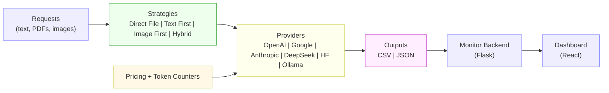
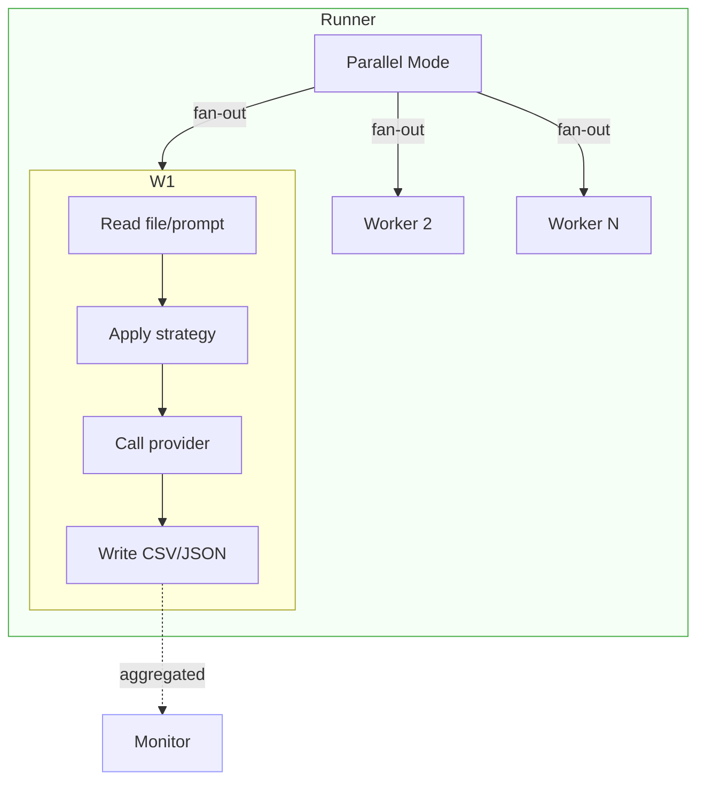

## Ultra Arena

### A unified platform to run text and file based requests against many LLMs — with a live monitor to compare cost and performance

Ultra Arena lets you process text- and file-based requests across multiple LLM providers and strategies, then visualize and compare their performance and costs side-by-side. It is designed for rapid iteration, fair benchmarking, and practical ops visibility.

## Highlights
- **🚀 Multi-provider**: OpenAI, Google, Anthropic (Claude), DeepSeek, Hugging Face, and local (Ollama)
- **🧠 Multiple strategies**: direct file, text-first, image-first, and hybrid
- **⚡ Parallel execution**: run many files or prompts concurrently
- **💰 Cost & token tracking**: standardized counters and pricing lookup
- **📊 Live monitoring**: dashboard to compare results, costs, and throughput
- **🧩 Extensible**: add new providers, models, or strategies easily

### How it works (at a glance)



## Repository layout
- `Ultra_Arena_Main/`: core runner, strategies, providers, config, and processors
- `Ultra_Arena_Monitor/`: monitoring backend (Flask) and static dashboard (React)
- `Ultra_Arena_Test_Example/`: small runnable example and a consolidated `modular_results.json`

Results are written under `Ultra_Arena_Main/output/` (e.g., `output/results/csv`). A sample consolidated JSON output is included at `Ultra_Arena_Test_Example/modular_results.json` for the monitor.

## Quick start

### 1) Prerequisites
- Python 3.10+
- Optional: Node is not required; the dashboard is served by Flask

### 2) Install dependencies
```bash
python -m venv .venv
source .venv/bin/activate

# Core runner
pip install -r Ultra_Arena_Main/requirements.txt

# Monitor backend
pip install -r Ultra_Arena_Monitor/backend/requirements.txt
```

### 3) Run the example
```bash
python Ultra_Arena_Test_Example/test_call.py
```
This processes the example PDF and produces results (CSV by default). A consolidated sample JSON is available at `Ultra_Arena_Test_Example/modular_results.json` for quick dashboard demos.

### 4) Start the monitoring dashboard
By default, the monitor looks for JSON files under `Ultra_Arena_Main/output/results/json`.

- To demo immediately with the sample consolidated results, set the directory to `Ultra_Arena_Test_Example` in `Ultra_Arena_Monitor/config/chart_config.py`:
  - `JSON_DATA_DIR = "Ultra_Arena_Test_Example"`

Then run:
```bash
python Ultra_Arena_Monitor/backend/server.py
```
Open `http://localhost:8000` to view the dashboard.

Note: The monitor backend also supports a single consolidated `modular_results.json` (it will load that file if present in the configured directory).

### Execution modes (parallelism)



## Configure providers
Set the corresponding environment variables before running:
- **OpenAI**: `OPENAI_API_KEY`
- **Google**: `GOOGLE_API_KEY`
- **Anthropic**: `ANTHROPIC_API_KEY`
- **DeepSeek**: `DEEPSEEK_API_KEY`
- **Hugging Face**: `HUGGINGFACE_API_TOKEN`
- **Ollama**: install and run Ollama locally (`ollama serve`)

## Strategies and modes
- **Strategies**: direct file, text-first, image-first, hybrid
- **Modes**: parallel, combo (batched parameter combinations)

You can choose strategies and modes via the config files in `Ultra_Arena_Main/config/`.

### Why Ultra Arena?
- **🔁 Fair apples-to-apples**: run the same inputs across many models and strategies
- **📈 Operational visibility**: token counts, costs, throughput, retries
- **🛠️ Pragmatic**: easy to add providers/strategies; monitor is zero-build (Flask + static React)
- **🏃 Fast iteration**: spin up experiments, compare, and decide quickly

## Extending
- Add a new provider under `Ultra_Arena_Main/llm_client/providers/`
- Add/modify pricing in `Ultra_Arena_Main/config/pricing/llm_prices.csv`
- Create new strategies under `Ultra_Arena_Main/llm_strategies/`

## Roadmap
- Native CSV ingestion in the monitor (the backend currently expects JSON; a consolidated `modular_results.json` is supported for convenience)
- Additional charts and latency breakdowns
- More example datasets and evaluation hooks

## License
This project is licensed under the MIT License. See `LICENSE` for details.

