# My_Ult_Parallel Project Architecture

## System Overview

## Processing Flow

## LLM Provider Architecture

## Strategy Comparison

```mermaid
graph TB
    %% Strategy Types - Enhanced with larger descriptions
    STRATEGIES[📋 Processing Strategies<br/>🎯 Choose Based on Document Type<br/>📊 Four Main Approaches Available] --> DIRECT[📄 Direct File Strategy<br/>🚀 Process Entire PDF Directly<br/>⚡ Fastest Processing Method]
    STRATEGIES --> TEXT[📝 Text First Strategy<br/>🔤 Extract Text First, Then Process<br/>💰 Most Cost-Effective Option]
    STRATEGIES --> IMAGE[🖼️ Image First Strategy<br/>📸 Convert to Images, Then Process<br/>🎨 Best for Visual Documents]
    STRATEGIES --> HYBRID[🔄 Hybrid Strategy<br/>🤝 Combine Text and Image Processing<br/>🎯 Highest Accuracy Approach]
    
    %% Direct File Strategy - Enhanced descriptions
    DIRECT --> DIRECT_DESC[📋 Process entire PDF directly<br/>📤 Send complete document to LLM<br/>🔄 No preprocessing required<br/>⚡ Immediate processing start]
    DIRECT --> DIRECT_USE[🎯 Use Case: Simple documents<br/>📖 Well-structured, text-heavy PDFs<br/>📑 Standard business documents<br/>📊 Reports and contracts]
    DIRECT --> DIRECT_PRO[✅ Pros: Simple, Fast<br/>🚀 Minimal preprocessing required<br/>⏱️ Quick turnaround time<br/>🔧 Easy to implement]
    DIRECT --> DIRECT_CON[❌ Cons: Token limits<br/>⚠️ May exceed model context windows<br/>📏 Large file restrictions<br/>💸 Higher token costs for big files]
    
    %% Text First Strategy - Enhanced descriptions
    TEXT --> TEXT_DESC[📝 Extract text first, then process<br/>🔤 Convert PDF to text before LLM<br/>🧹 Clean text extraction<br/>📋 Structured text output]
    TEXT --> TEXT_USE[🎯 Use Case: Text-heavy documents<br/>📚 Documents with primarily textual content<br/>📰 Articles and research papers<br/>📋 Text-based forms]
    TEXT --> TEXT_PRO[✅ Pros: Lower cost, Text-focused<br/>💰 Efficient for text extraction tasks<br/>⚡ Fast processing speed<br/>🎯 Accurate text recognition]
    TEXT --> TEXT_CON[❌ Cons: Loses visual context<br/>👁️ May miss layout and formatting cues<br/>🖼️ No image processing<br/>📐 Layout information lost]
    
    %% Image First Strategy - Enhanced descriptions
    IMAGE --> IMAGE_DESC[🖼️ Convert to images, then process<br/>📸 Render PDF pages as images<br/>🎨 Preserve visual elements<br/>📱 High-quality image output]
    IMAGE --> IMAGE_USE[🎯 Use Case: Visual documents<br/>📊 Forms, charts, diagrams, scanned docs<br/>🖼️ Image-heavy presentations<br/>📐 Complex layouts]
    IMAGE --> IMAGE_PRO[✅ Pros: Preserves layout<br/>🎨 Maintains visual structure and formatting<br/>📏 Accurate spatial relationships<br/>🖼️ Complete visual context]
    IMAGE --> IMAGE_CON[❌ Cons: Higher cost, Image limits<br/>💸 More expensive processing<br/>📊 Image count restrictions<br/>⏱️ Slower processing time]
    
    %% Hybrid Strategy - Enhanced descriptions
    HYBRID --> HYBRID_DESC[🔄 Combine text and image processing<br/>🤝 Use both approaches strategically<br/>🎯 Best of both worlds<br/>⚖️ Balanced approach]
    HYBRID --> HYBRID_USE[🎯 Use Case: Complex documents<br/>📊 Mixed content with text and visuals<br/>📋 Advanced business documents<br/>🔬 Technical specifications]
    HYBRID --> HYBRID_PRO[✅ Pros: Best accuracy<br/>🎯 Leverages strengths of both approaches<br/>🏆 Highest quality results<br/>🔍 Comprehensive analysis]
    HYBRID --> HYBRID_CON[❌ Cons: Highest cost, Complexity<br/>💸 Most expensive option<br/>⚙️ Complex implementation<br/>⏱️ Longest processing time]
    
    %% Enhanced Styling
    classDef strategy fill:#e1f5fe,stroke:#01579b,stroke-width:3px
    classDef description fill:#f3e5f5,stroke:#4a148c,stroke-width:2px
    classDef useCase fill:#e8f5e8,stroke:#1b5e20,stroke-width:2px
    classDef pros fill:#fff3e0,stroke:#e65100,stroke-width:2px
    classDef cons fill:#ffebee,stroke:#b71c1c,stroke-width:2px
    
    class STRATEGIES,DIRECT,TEXT,IMAGE,HYBRID strategy
    class DIRECT_DESC,TEXT_DESC,IMAGE_DESC,HYBRID_DESC description
    class DIRECT_USE,TEXT_USE,IMAGE_USE,HYBRID_USE useCase
    class DIRECT_PRO,TEXT_PRO,IMAGE_PRO,HYBRID_PRO pros
    class DIRECT_CON,TEXT_CON,IMAGE_CON,HYBRID_CON cons
```

## Data Processing Pipeline

```mermaid
graph TB
    %% Simplified Pipeline - 40% reduction
    INPUT[📁 PDF Files] --> VALIDATE[✅ Validate]
    VALIDATE --> STRATEGY[⚙️ Apply Strategy]
    STRATEGY --> LLM[🤖 LLM Processing]
    
    LLM --> PARSE[📋 Parse Response]
    PARSE --> SUCCESS{✅ Valid?}
    SUCCESS -->|Yes| SAVE[💾 Save Results]
    SUCCESS -->|No| RETRY{🔄 Retry?}
    RETRY -->|Yes| LLM
    RETRY -->|No| ERROR[❌ Error]
    
    SAVE --> OUTPUT[📊 Output Files]
    ERROR --> OUTPUT
    
    %% Simplified Styling
    classDef input fill:#e8f5e8,stroke:#1b5e20,stroke-width:2px
    classDef process fill:#e3f2fd,stroke:#01579b,stroke-width:2px
    classDef decision fill:#fff9c4,stroke:#ff6f00,stroke-width:2px
    classDef output fill:#f3e5f5,stroke:#4a148c,stroke-width:2px
    classDef error fill:#ffebee,stroke:#b71c1c,stroke-width:2px
    
    class INPUT input
    class VALIDATE,STRATEGY,LLM,PARSE,SAVE process
    class SUCCESS,RETRY decision
    class OUTPUT output
    class ERROR error
```

## Configuration Management

```mermaid
graph TB
    %% Configuration Hierarchy - Enhanced with icons and detailed descriptions
    CONFIG_ROOT[⚙️ Configuration System<br/>🎛️ Centralized Settings Management<br/>📋 All System Parameters<br/>🔧 Dynamic Configuration] --> BASE_CONFIG[📋 config_base.py<br/>🏗️ Base Configuration Settings<br/>🎯 Core System Parameters<br/>📊 Default Values]
    CONFIG_ROOT --> COMBO_CONFIG[🔄 config_combo_run.py<br/>🎮 Combo Run Configurations<br/>🧪 Test Scenario Definitions<br/>📊 Batch Processing Setup]
    CONFIG_ROOT --> PROVIDER_CONFIGS[🤖 Provider Configs<br/>🌐 LLM Provider Settings<br/>🔑 API Configuration<br/>⚡ Performance Tuning]
    
    %% Base Configuration - Enhanced descriptions
    BASE_CONFIG --> SYSTEM_PROMPT[🤖 System Prompts<br/>📝 AI Instruction Templates<br/>🎯 Behavior Guidelines<br/>📋 Processing Instructions]
    BASE_CONFIG --> USER_PROMPT[👤 User Prompts<br/>❓ User Query Templates<br/>🎯 Input Formatting<br/>📋 Request Structure]
    BASE_CONFIG --> STRATEGY_TYPES[🎯 Strategy Types<br/>⚙️ Processing Strategy Definitions<br/>🔄 Method Selection<br/>📊 Performance Profiles]
    BASE_CONFIG --> PROCESSING_MODES[⚡ Processing Modes<br/>🔄 Parallel vs Batch Settings<br/>🎛️ Concurrency Control<br/>📊 Resource Management]
    
    %% Combo Configuration - Enhanced with detailed test scenarios
    COMBO_CONFIG --> COMBO1[🧪 combo1: 4 files<br/>📊 Small Test Configuration<br/>⚡ Quick Validation<br/>🎯 Basic Functionality]
    COMBO_CONFIG --> COMBO2[🧪 combo2: 4 files<br/>🔄 Alternative Test Setup<br/>📊 Different Parameters<br/>🎯 Comparison Testing]
    COMBO_CONFIG --> COMBO_TEST_4[🎯 combo_test_4_strategies: 1 file<br/>📋 Single File Multi-Strategy Test<br/>🔍 Strategy Comparison<br/>📊 Performance Analysis]
    COMBO_CONFIG --> COMBO_TEST_8[📊 combo_test_8_strategies: Multiple files<br/>🏆 Comprehensive Strategy Testing<br/>📈 Large Scale Validation<br/>🔍 Full Coverage Analysis]
    COMBO_CONFIG --> COMBO_TEST_IMG[🖼️ combo_test_imageF_strategies<br/>📸 Image-First Strategy Testing<br/>🎨 Visual Processing Focus<br/>📊 Layout Analysis]
    COMBO_CONFIG --> COMBO_TEST_GOOGLE[🌐 combo_test_google_strategies<br/>🤖 Google Provider Testing<br/>⚡ Gemini Model Validation<br/>📊 Google AI Performance]
    COMBO_CONFIG --> COMBO_TEST_CLAUDE[🧠 combo_test_claude_strategies<br/>🤖 Claude Provider Testing<br/>🎯 Anthropic Model Focus<br/>📊 Claude Performance]
    COMBO_CONFIG --> COMBO_TEST_DEEPSEEK[🔍 combo_test_deepseek_strategies<br/>🤖 DeepSeek Provider Testing<br/>🎯 Advanced Model Testing<br/>📊 DeepSeek Analysis]
    
    %% Provider Configurations - Enhanced with detailed settings
    PROVIDER_CONFIGS --> GOOGLE_CONFIG[🌐 Google Gemini Config<br/>🤖 Google AI Settings<br/>🔑 API Key Management<br/>⚡ Rate Limiting]
    PROVIDER_CONFIGS --> CLAUDE_CONFIG[🧠 Claude Config<br/>🤖 Anthropic Claude Settings<br/>🎯 Model Parameters<br/>📊 Usage Optimization]
    PROVIDER_CONFIGS --> OPENAI_CONFIG[🤖 OpenAI Config<br/>🧠 OpenAI GPT Settings<br/>🔑 Authentication Setup<br/>⚡ Performance Tuning]
    PROVIDER_CONFIGS --> DEEPSEEK_CONFIG[🔍 DeepSeek Config<br/>🤖 DeepSeek Model Settings<br/>🎯 Advanced Parameters<br/>📊 Cost Optimization]
    PROVIDER_CONFIGS --> HUGGINGFACE_CONFIG[🤗 HuggingFace Config<br/>🤖 HuggingFace Model Settings<br/>🌐 Model Hub Access<br/>⚡ Local/Remote Toggle]
    PROVIDER_CONFIGS --> OLLAMA_CONFIG[🏠 Ollama Config<br/>🤖 Local Ollama Settings<br/>🔧 Local Model Management<br/>⚡ Hardware Optimization]
    
    %% Enhanced Styling with borders and visual hierarchy
    classDef root fill:#e1f5fe,stroke:#01579b,stroke-width:4px
    classDef base fill:#f3e5f5,stroke:#4a148c,stroke-width:3px
    classDef combo fill:#e8f5e8,stroke:#1b5e20,stroke-width:3px
    classDef provider fill:#fff3e0,stroke:#e65100,stroke-width:3px
    
    class CONFIG_ROOT root
    class BASE_CONFIG,SYSTEM_PROMPT,USER_PROMPT,STRATEGY_TYPES,PROCESSING_MODES base
    class COMBO_CONFIG,COMBO1,COMBO2,COMBO_TEST_4,COMBO_TEST_8,COMBO_TEST_IMG,COMBO_TEST_GOOGLE,COMBO_TEST_CLAUDE,COMBO_TEST_DEEPSEEK combo
    class PROVIDER_CONFIGS,GOOGLE_CONFIG,CLAUDE_CONFIG,OPENAI_CONFIG,DEEPSEEK_CONFIG,HUGGINGFACE_CONFIG,OLLAMA_CONFIG provider
```

## File Structure Overview

```mermaid
graph TB
    %% Project Structure - Enhanced with detailed icons and descriptions
    ROOT[🏗️ My_Ult_Parallel<br/>📁 Main Project Directory<br/>🚀 PDF Processing System<br/>🤖 LLM Integration Platform] --> MAIN[🎯 main_modular.py<br/>🚀 Entry Point Script<br/>⚡ System Orchestrator<br/>📋 Main Processing Controller]
    ROOT --> CONFIG_DIR[⚙️ config/<br/>📋 Configuration Directory<br/>🎛️ System Settings<br/>🔧 Parameter Management]
    ROOT --> LLM_DIR[🤖 llm_client/<br/>🌐 LLM Client Directory<br/>🔌 Provider Integrations<br/>🧠 AI Model Interfaces]
    ROOT --> STRATEGY_DIR[🎯 llm_strategies/<br/>⚙️ Strategy Implementation Directory<br/>🔄 Processing Methods<br/>📊 Algorithm Definitions]
    ROOT --> PROCESSOR_DIR[⚡ processors/<br/>🔄 Processing Logic Directory<br/>🏭 Core Engine Components<br/>📊 Execution Management]
    ROOT --> COMMON_DIR[🔧 common/<br/>🛠️ Shared Utilities Directory<br/>📦 Reusable Components<br/>🔄 Helper Functions]
    ROOT --> BENCHMARK_DIR[📊 benchmark/<br/>🎯 Benchmarking Tools Directory<br/>📈 Performance Analysis<br/>🔍 Quality Assessment]
    ROOT --> INPUT_DIR[📁 input_files/<br/>📄 Input Documents Directory<br/>📋 Source PDF Files<br/>🗂️ File Organization]
    ROOT --> OUTPUT_DIR[📤 output/<br/>🗃️ Results Output Directory<br/>📊 Processed Data<br/>📈 Analysis Results]
    
    %% Config Directory - Enhanced with detailed file descriptions
    CONFIG_DIR --> CONFIG_BASE[📋 config_base.py<br/>🏗️ Base Configuration File<br/>🎯 Core System Parameters<br/>📊 Default Settings]
    CONFIG_DIR --> CONFIG_COMBO[🎮 combo_run/config_combo_run.py<br/>🧪 Combo Run Configuration<br/>📊 Test Scenario Definitions<br/>🔄 Batch Processing Setup]
    CONFIG_DIR --> CONFIG_DIRECT[📄 config_direct_file.py<br/>🚀 Direct File Strategy Config<br/>⚡ Fast Processing Settings<br/>🎯 Direct PDF Handling]
    CONFIG_DIR --> CONFIG_TXT[📝 config_txt_first.py<br/>🔤 Text First Strategy Config<br/>💰 Cost-Effective Settings<br/>📋 Text Extraction Focus]
    CONFIG_DIR --> CONFIG_IMG[🖼️ config_image_first.py<br/>📸 Image First Strategy Config<br/>🎨 Visual Processing Settings<br/>📐 Layout Preservation]
    CONFIG_DIR --> CONFIG_HF[🤗 config_huggingface.py<br/>🌐 HuggingFace Provider Config<br/>🤖 Model Hub Integration<br/>⚡ Local/Remote Options]
    
    %% LLM Client Directory - Enhanced with provider details
    LLM_DIR --> LLM_BASE[🏗️ llm_client_base.py<br/>🔧 Base LLM Client Class<br/>📋 Abstract Interface<br/>🎯 Common Functionality]
    LLM_DIR --> LLM_FACTORY[🏭 llm_client_factory.py<br/>⚙️ LLM Client Factory<br/>🔄 Provider Selection<br/>🎯 Dynamic Instantiation]
    LLM_DIR --> PROVIDERS[🌐 providers/<br/>🤖 Provider Implementations<br/>🔌 API Integrations<br/>⚡ Model Interfaces]
    
    PROVIDERS --> GOOGLE_CLIENT[🌐 google_genai_client.py<br/>🤖 Google Gemini Client<br/>⚡ Gemini API Integration<br/>🎯 Google AI Services]
    PROVIDERS --> CLAUDE_CLIENT[🧠 claude_client.py<br/>🤖 Anthropic Claude Client<br/>🎯 Claude API Integration<br/>💭 Advanced Reasoning]
    PROVIDERS --> OPENAI_CLIENT[🤖 openai_client.py<br/>🧠 OpenAI GPT Client<br/>🔥 GPT API Integration<br/>⚡ High Performance]
    PROVIDERS --> DEEPSEEK_CLIENT[🔍 deepseek_client.py<br/>🤖 DeepSeek Client<br/>🎯 Advanced Model Access<br/>📊 Specialized Processing]
    PROVIDERS --> HF_CLIENT[🤗 huggingface_client.py<br/>🌐 HuggingFace Client<br/>📦 Model Hub Access<br/>🏠 Local Model Support]
    PROVIDERS --> OLLAMA_CLIENT[🏠 ollama_client.py<br/>🤖 Ollama Local Client<br/>💻 Local Model Management<br/>⚡ Hardware Optimization]
    
    %% Strategy Directory - Enhanced with strategy details
    STRATEGY_DIR --> STRATEGY_BASE[🏗️ base_strategy.py<br/>📋 Base Strategy Abstract Class<br/>🎯 Common Interface<br/>🔄 Shared Functionality]
    STRATEGY_DIR --> DIRECT_STRATEGY[📄 direct_file_strategy.py<br/>🚀 Direct File Processing Strategy<br/>⚡ Fastest Method<br/>🎯 Simple Documents]
    STRATEGY_DIR --> TEXT_STRATEGY[📝 text_first_strategy.py<br/>🔤 Text First Processing Strategy<br/>💰 Cost-Effective<br/>📋 Text-Heavy Documents]
    STRATEGY_DIR --> IMAGE_STRATEGY[🖼️ image_first_strategy.py<br/>📸 Image First Processing Strategy<br/>🎨 Visual Documents<br/>📐 Layout Preservation]
    STRATEGY_DIR --> HYBRID_STRATEGY[🔄 hybrid_strategy.py<br/>🤝 Hybrid Processing Strategy<br/>🏆 Best Accuracy<br/>📊 Complex Documents]
    STRATEGY_DIR --> STRATEGY_FACTORY[🏭 strategy_factory.py<br/>⚙️ Strategy Factory Pattern<br/>🎯 Dynamic Selection<br/>🔄 Runtime Configuration]
    
    %% Processor Directory - Enhanced with processing details
    PROCESSOR_DIR --> MODULAR_PROC[🏭 modular_parallel_processor.py<br/>⚡ Main Processing Engine<br/>🔄 Parallel Execution<br/>🎯 Core Orchestrator]
    PROCESSOR_DIR --> PROCESSING_STRATS[⚙️ processing_strategies.py<br/>🎯 Strategy Processing Logic<br/>🔄 Method Implementation<br/>📊 Execution Control]
    PROCESSOR_DIR --> FILE_MAPPING[🗂️ file_mapping_utils.py<br/>📁 File Organization Utilities<br/>🔄 Batch Management<br/>📋 Group Processing]
    PROCESSOR_DIR --> BENCHMARK_TRACKER[📊 benchmark_tracker.py<br/>🎯 Performance Tracking<br/>📈 Quality Metrics<br/>🔍 Accuracy Assessment]
    PROCESSOR_DIR --> CHECKPOINT_MGR[💾 checkpoint_manager.py<br/>🔄 Progress Checkpointing<br/>⚡ Resume Capability<br/>🛡️ Fault Tolerance]
    PROCESSOR_DIR --> STATS_CALC[📊 statistics_calculator.py<br/>📈 Statistical Analysis<br/>🔍 Performance Metrics<br/>📋 Report Generation]
    
    %% Common Directory - Enhanced with utility details
    COMMON_DIR --> BASE_MONITOR[📊 base_monitor.py<br/>🔍 Performance Monitoring Base<br/>📈 System Metrics<br/>⚡ Real-time Tracking]
    COMMON_DIR --> BENCHMARK_COMP[🎯 benchmark_comparator.py<br/>📊 Benchmark Comparison Logic<br/>🔍 Accuracy Analysis<br/>📈 Quality Assessment]
    COMMON_DIR --> CSV_DUMPER[📊 csv_dumper.py<br/>📈 CSV Export Utilities<br/>📋 Data Export<br/>📊 Report Generation]
    
    %% Benchmark Directory - Enhanced with benchmarking details
    BENCHMARK_DIR --> BENCHMARK_ADAPTER[🔌 benchmark_adapter.py<br/>📊 Benchmark Data Adapter<br/>🔄 Data Interface<br/>📋 Format Conversion]
    BENCHMARK_DIR --> BENCHMARK_MGR[🎯 benchmark_manager.py<br/>📊 Benchmark Management<br/>🔍 Quality Control<br/>📈 Performance Standards]
    BENCHMARK_DIR --> BENCHMARK_REPORTER[📈 benchmark_reporter.py<br/>📊 Benchmark Reporting<br/>📋 Analysis Output<br/>🔍 Detailed Metrics]
    
    %% Enhanced Styling with visual hierarchy
    classDef root fill:#e1f5fe,stroke:#01579b,stroke-width:4px
    classDef main fill:#f3e5f5,stroke:#4a148c,stroke-width:3px
    classDef config fill:#e8f5e8,stroke:#1b5e20,stroke-width:3px
    classDef llm fill:#fff3e0,stroke:#e65100,stroke-width:3px
    classDef strategy fill:#fce4ec,stroke:#ad1457,stroke-width:3px
    classDef processor fill:#f1f8e9,stroke:#2e7d32,stroke-width:3px
    classDef common fill:#e0f2f1,stroke:#00695c,stroke-width:3px
    classDef benchmark fill:#fff8e1,stroke:#f57f17,stroke-width:3px
    
    class ROOT root
    class MAIN main
    class CONFIG_DIR,CONFIG_BASE,CONFIG_COMBO,CONFIG_DIRECT,CONFIG_TXT,CONFIG_IMG,CONFIG_HF config
    class LLM_DIR,LLM_BASE,LLM_FACTORY,PROVIDERS,GOOGLE_CLIENT,CLAUDE_CLIENT,OPENAI_CLIENT,DEEPSEEK_CLIENT,HF_CLIENT,OLLAMA_CLIENT llm
    class STRATEGY_DIR,STRATEGY_BASE,DIRECT_STRATEGY,TEXT_STRATEGY,IMAGE_STRATEGY,HYBRID_STRATEGY,STRATEGY_FACTORY strategy
    class PROCESSOR_DIR,MODULAR_PROC,PROCESSING_STRATS,FILE_MAPPING,BENCHMARK_TRACKER,CHECKPOINT_MGR,STATS_CALC processor
    class COMMON_DIR,BASE_MONITOR,BENCHMARK_COMP,CSV_DUMPER common
    class BENCHMARK_DIR,BENCHMARK_ADAPTER,BENCHMARK_MGR,BENCHMARK_REPORTER benchmark
``` 

